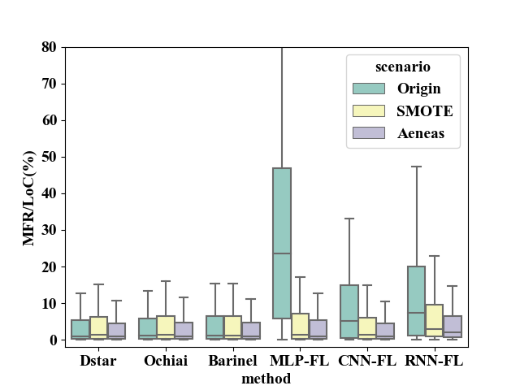

# :warning: The comparison of SMOTE and Aeneas :warning:

SMOTE is a oversampling technique that should be involved in our evaluation. The SMOTE algorithm creates artificial data based on the feature space similarities between existing minority examples.
The formula of SMOTE is 
*\\delta), 
where  and  are the nearest neighbors of same class,  is a random number.

Due to the space limitaion, we show the results of SMOTE in this github repo.
The table below shows the results of the comparison of SMOTE and our approach and the results demonstrate the SMOTE performs well in most cases when compared with original methods and underperforms Aeneas. 

|       |        | Dstar  | Ochiai | Barinel | RNN-FL  | MLP-FL  | CNN-FL  |
| :---- | :----- | :----- | :----- | :------ | :------ | :------ | :------ |
|       | origin | 448.23 | 464.89 | 485.80  | 1311.63 | 1816.47 | 773.57  |
| MFR   | SMOTE  | 469.13 | 482.16 | 485.74  | 559.45  | 492.56  | 518.63  |
|       | Aeneas | 361.08 | 333.82 | 332.54  | 376.03  | 334.78  | 417.56  |
|       | origin | 42     | 42     | 38      | 9       | 9       | 31      |
| TOP-1 | SMOTE  | 40     | 40     | 38      | 9       | 40      | 40      |
|       | Aeneas | 45     | 45     | 42      | 15      | 46      | 45      |
|       | origin | 98     | 98     | 86      | 33      | 24      | 71      |
| TOP-3 | SMOTE  | 90     | 91     | 86      | 38      | 89      | 90      |
|       | Aeneas | 98     | 99     | 99      | 48      | 98      | 98      |
|       | origin | 120    | 122    | 116     | 52      | 30      | 81      |
| TOP-5 | SMOTE  | 114    | 114    | 115     | 60      | 114     | 114     |
|       | Aeneas | 127    | 127    | 131     | 73      | 127     | 128     |
|       | origin | 828.84 | 792.77 | 807.64  | 1690.55 | 2165.98 | 1167.79 |
| MAR   | SMOTE  | 923.32 | 874.83 | 899.74  | 1203.34 | 973.37  | 881.86  |
|       | Aeneas | 714.05 | 631.79 | 611.82  | 638.54  | 594.88  | 767.40  |

### boxplot


### Wilcoxon signed-rank test
| method  | comparison | greater |   less   | two-sided | conclusion |
| :-----: | :--------: | :-----: | :------: | :-------: | :--------: |
|  Dstar  |   SMOTE    |    1    | 8.72E-34 | 1.74E-33  |   BETTER   |
| Ochiai  |   SMOTE    |    1    | 3.38E-32 | 6.76E-32  |   BETTER   |
| Barinel |   SMOTE    |    1    | 3.88E-34 | 7.75E-34  |   BETTER   |
| MLP-FL  |   SMOTE    |    1    | 8.32E-39 | 1.66E-38  |   BETTER   |
| CNN-FL  |   SMOTE    |    1    | 1.77E-38 | 3.54E-38  |   BETTER   |
| RNN-FL  |   SMOTE    |    1    | 1.42E-51 | 2.84E-51  |   BETTER   |

# A Universal Data Augmentation Approach for Fault Localization

## Introduction

This repository provides source code of **Aeneas**.

**Aeneas** is a data augmentation approach that aims at handling the between-class problem rooted in the natural of the program test suite. Specifically, **Aeneas** gener**A**t**e**s sy**n**thesized failing t**e**st cases from reduced fe**a**ture **s**apce.

## Environment

- OS: Linux
- Python package:
  - pandas==0.25.1
  - chardet==3.0.4
  - numpy==1.16.5
  - torch==1.9.0

## Structure

The structure of the repository is as follows:

```
calculate_suspiciousness
|____CalculateSuspiciousness.py	:calculate suspiciousness of each statement and give the MFR rank or MAR rank according to the real fault line.
data
|____d4j :Defects4J dataset	
|____manybugs :MangBugs dataset	
|____sir :SIR dataset		
|____motivation :artificial dataset	
data_process
|____data_systhesis :data synthesis approaches
|    |____CVAE_model.py
|    |____cvae_synthesis.py
|    |____resampling.py
|    |____smote.py
|____data_undersampling :undersampling approaches
|	 |____undersampling.py
|____dimensional_reduction :feature selection
|	 |____PCA.py		
metrics : SFL and DLFL metrics
|____calc_corr.py
|____dl_metrics.py
|____metrics.py
pipeline
|____Pipeline.py : load different type of data, process data and calculate suspiciousness task
read_data : load data according to args
|____DataLoader.py
|____Defects4JDataLoader.py
|____ManyBugsDataLoader.py
|____SIRDataLoader.py
results : store the results in txt format
utils : some utils during pipeline
|____args_util.py
|____file_util.py
|____read_util.py
|____write_util.py
run.py : program entry
```

## Usage

To run the program, commandline parameters are needed.

**required arguments: **

| name |  meaning   |                    value                     |
| :--: | :--------: | :------------------------------------------: |
|  -d  |  dataset   |           "d4j", "manybugs","SIR"            |
|  -p  |  program   |   "Chart", "Closure", "Time", "Lang", ...    |
|  -i  |   bug_id   |                "1", "2", ...                 |
|  -m  |   method   | "dstar", "ochiai", "barinel", "MLP-FL", ...  |
|  -e  | experiment | "origin", "resampling", "undersampling", ... |

**optional arguments:**

| name |        meaning        | value  |
| :--: | :-------------------: | :----: |
| -cp  | component percentage  | [0, 1] |
| -ep  | eigenvalue percentage | [0, 1] |

To show how to run the program, we give the examples of "illustrative example" in our paper.

### original method

```
run.py -d manybugs -p motivation -i artificial_bug -m GP02 -e origin
```

After the program end, the MAR rank as the following format will store in `result` folder.

`motivation-artificial_bug   GP02   12 `

`motivation-artifiial_bug` is the program with bug_id, `GP02` is the fault localization method and `12` is the final rank that  locate the first bug of the program by using the method. 

### resampling method

```
run.py -d manybugs -p motivation -i artificial_bug -m GP02 -e resampling
```

`motivation-artificial_bug   GP02   7`

### undersampling method

```
run.py -d manybugs -p motivation -i artificial_bug -m GP02 -e undersampling
```

`motivation-artificial_bug   GP02   7  `

### smote method

```
run.py -d manybugs -p motivation -i artificial_bug -m GP02 -e undersampling
```

`motivation-artificial_bug	GP02	7  `

### feature selection

```
run.py -d manybugs -p motivation -i artificial_bug -m GP02 -e fs -cp 0.75 -ep 0.75
```

`motivation-artificial_bug   GP02   9  `

### Aeneas

```
run.py -d manybugs -p motivation -i artificial_bug -m GP02 -e fs_cvae -cp 0.75 -ep 0.75
```

`motivation-artificial_bug   GP02   5  `

The results of **Aeneas** may be sightly different because we use the neural network in **Aeneas**.

## **ALL** suggestions are welcomed
